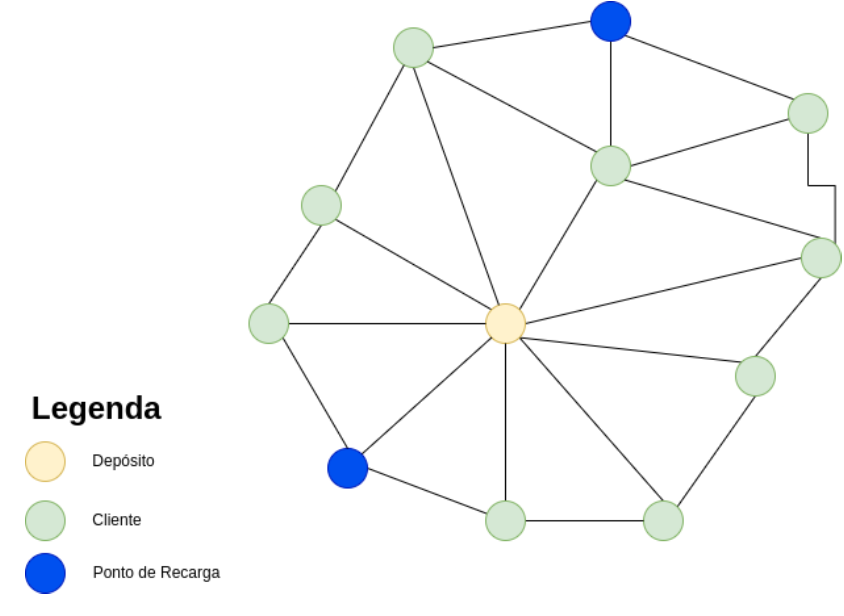

# Roteamento de veículos elétricos para entregas em áreas urbanas

  
  
  
   

Aluno: Frank Laércio da C. S. Júnior (frank.junior.118@ufrn.edu.br)  
Docentes: Elizabeth Ferreira Gouvea Goldbarg e Silvia Maria Diniz Monteiro Maia

## Resumo

  O objetivo deste relatório é apresentar a resolução do problema de distribuição de mercadorias enviadas por plataformas com veículos elétricos, com o objetivo de  calcular as menores rotas e o menor custo utilizando noções e conceitos aprendidos na disciplina de Grafos. Para a realização deste trabalho, analisou-se a resolução de problemas reais através da aplicação de grafos utilizando o Problema do Roteamento de Veículos Capacitados (PRVC), considerando que o veículo possui um limite máximo em sua capacidade de transporte e também energética.

<b>Palavras-chave:</b> Grafos. Problemas reais. Menor rota. Roteamento de Veículos Capacitados.

## Introdução

  
Após a Revolução Industrial a emissão de poluentes vem crescendo exponencialmente em nossa sociedade. Porém, mais da metade das emissões de CO2 foram feitas nos últimos 30 anos, conforme os dados do Global Carbon Project.

  
No Brasil, segundo dados do Sistema de Estimativas de Emissões de Gases de Efeito Estufa (SEEG), no ano de 2020, a emissão de gases de efeito estufa cresceram 9,5%, mesmo que durante a pandemia o mundo tenha poluído 7% a menos no período de confinamento. Ou seja, nós como sociedade caminhamos para um colapso ambiental e isso nos faz refletir sobre como lidamos com o nosso meio ambiente e o que podemos fazer para ajudá-lo.

  
Portanto, o objetivo deste relatório é aplicar os conceitos teóricos e práticos aprendidos em sala de aula na disciplina de Grafos para cenários cotidianos e buscar meios de ajudar na diminuição de emissão de gases poluentes e custos na logística de entrega de encomendas realizadas utilizando veículos elétricos.

  
  ## Descrição do problema real
  
A situação-problema em questão visa otimizar os custos logísticos das operações de envio de encomendas aos clientes, levando em consideração diversos aspectos, como tempo de entrega, custo de envio, recarga da bateria dos veículos elétricos e a menor quantidade de viagens possíveis. Para isso, as empresas possuem uma rede de depósitos estrategicamente distribuídos em zonas específicas, bem como uma frota de veículos disponíveis para realizar as entregas até o destino final.

  
A fim de alcançar o objetivo de otimização dos recursos, é fundamental maximizar o número de entregas realizadas por cada veículo, partindo de um depósito inicial e percorrendo a menor rota possível para cada entrega. Essa funcionalidade é obtida por meio do uso de algoritmos baseados em grafos, que tratam especificamente de veículos capacitados, levando em consideração a capacidade dos veículos elétricos e as restrições operacionais.

  
A aplicação de algoritmos em grafo permite modelar o problema de roteamento de veículos elétricos de entrega em áreas urbanas, considerando a localização dos pontos de entrega e recarga como vértices, e as rotas possíveis entre eles como arestas. Com base nessa modelagem, os algoritmos são capazes de encontrar soluções otimizadas que minimizam a distância percorrida pelos veículos, reduzem os custos operacionais e contribuem para uma operação logística eficiente e sustentável.

  
Portanto, a abordagem proposta busca utilizar algoritmos em grafo para resolver o problema de roteamento de veículos elétricos de entrega em áreas urbanas, visando otimizar a utilização dos recursos disponíveis, minimizar os custos logísticos e proporcionar um serviço de entrega eficiente aos clientes.

## Modelagem em grafos

  
A modelagem do grafo é feita com base nos seguintes participantes chaves do problema: cliente, veículo, rota, recarga e depósito. O cliente é descrito no grafo com o vértice e tem a sua capacidade esperada para uma determinada compra. Já com o veículo é simplesmente levado em consideração a sua capacidade para realizar uma viagem. A rota é a otimização feita pelo algoritmo, levando em consideração a capacidade dos veículos e o menor percurso a ser feito, sendo representada visualmente com as arestas. Já os pontos de recargas podem recuperar a capacidade máxima do veículo durante a rota. Por fim, o(s) depósito(s) são representados como capacidade zero(s) e é onde partem os veículos.

  
  
Na figura acima é possível visualizar um exemplo de como é uma determinada região atendida por essa empresa. O nó central (com capacidade zero) é o depósito, e é dele onde partem as rotas realizadas pelos veículos. Além disso, cada vértice representa um cliente que tem uma capacidade definida pelo produto que ele irá receber.

  
Por fim, a resolução das entregas dos produtos será executada respeitando todos os seguintes critérios abaixo: 
    <ul>
      <li>Deverá partir de um depósito central.</li>
      <li>Os veículos possuem capacidade máxima de 50 para as suas encomendas.</li>
      <li>A autonomia da bateria é de no máximo 100</li>
      <li>Cada aresta é ponderada com o custo da distância percorrida</li>
      <li>Cada cliente deve ter a sua capacidade descrita com base na capacidade da compra realizada.</li>
      <li>As rotas devem ser calculadas utilizando o algoritmo de Clarke Wright (Saving Routes).</li>
    </ul>
  

## Algoritmo

  
O algoritmo de Clarke & Wright Savings é um dos heurísticos estudos em PRVC sendo baseado no princípio da economia de recursos (Clarke e Wright, 1964). A ideia é que a cada passo do algoritmo os fatores de restrições são considerados.

  
O princípio do algoritmo se baseia na ideia de que se há duas rotas diferentes r = (0, ..., i, 0) e s = (0, j, ..., 0) que são factíveis de uma fusão (merge) em uma nova rota t = (0, ..., i, j, ...0), a fusão dessas rotas gera uma economia de custo Sij [10], definida por: Sij = C(0, i) + C(0,j) - C(i,j) (OLIVEIRA e DELGADO, 2015).

  
Logo, a junção dos caminhos são factíveis quando a soma de um ou mais rotas não excedem a capacidade mais do veículo. Sendo Q a carga máxima de cada automóvel. Para este algoritmo de Clarke e Wright Savings existe a versão paralela e sequencial. A diferença consta que na versão paralela mais de uma rota é considerada na construção do caminho.

## Conclusão

  
O problema de roteamento de veículos elétricos de entrega em áreas urbanas é um desafio complexo que envolve a otimização de recursos levando em consideração restrições de autonomia da bateria, disponibilidade de pontos de recarga, restrições de tempo de entrega e de entregas.

  
Através da aplicação de técnicas de otimização, como o algoritmo de Clarke & Wright modificado, é possível encontrar soluções eficientes que reduzem a distância percorrida pelos veículos elétricos e, assim, economizam energia e reduzem as emissões de poluentes.

  
Ao utilizar uma abordagem baseada em grafos e considerar a autonomia dos veículos e a disponibilidade de pontos de recarga ao longo das rotas, é possível obter um roteamento otimizado que contribui para a eficiência e sustentabilidade das operações de entrega em áreas urbanas.

  
Essa solução traz benefícios tanto para as empresas de logística, que podem reduzir custos operacionais e melhorar a eficiência de suas operações, quanto para o meio ambiente, ao promover a utilização de veículos elétricos de forma mais sustentável. Portanto, investir em técnicas de otimização do roteamento de veículos elétricos de entrega em áreas urbanas é fundamental para alcançar um transporte mais eficiente, sustentável e alinhado com as necessidades das cidades modernas.

### Licença

Este projeto é licenciado seguindo a normas da MIT License - veja o arquivo LICENSE.md para maiores detalhes.

Feito com :hearts: by Frank Laércio :wave:!
